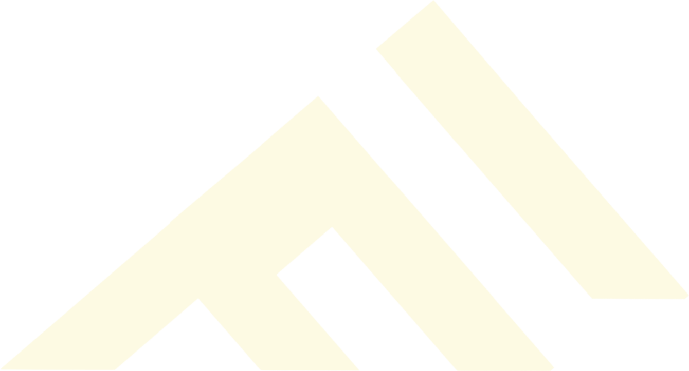

<table>
  <tr>
    <td></td>
    <td><h1>Fezadan Mimari & Güvenlik Dökümantasyonu (v3)</h1></td>
  </tr>
</table>

Fezadan, dışa bağımlılıkları minimize edilmiş, yüksek performanslı ve güvenlik odaklı özel bir **PHP MVC (Model-View-Controller)** mimarisidir. V3.0.0 güncellemesi ile birlikte sistemin ağırlık merkezi siber güvenlik, bulut tabanlı yük dağıtımı (CDN) ve otonom sistemler üzerine inşa edilmiştir.

---

## 1. Mimari Felsefe ve Dışa Bağımlılık
Sistem, modern web uygulamalarındaki aşırı dışa bağımlılığı ve izlenme (tracking) riskini azaltmak için **kendi kendine yeten (self-sufficient)** bir yapıda tasarlanmıştır:

* **Lokal Analitik:** Google Analytics gibi ziyaretçi verilerini toplayan harici izleyiciler yerine, PHP tabanlı ve token doğrulamalı yerel bir sayaç algoritması kullanılır.
* **İzole Edilmiş Asset Yönetimi:** Sistemde kullanılan CSS, JavaScript kütüphaneleri ve yazı tipleri (Fonts) dış kaynaklı public CDN'ler üzerinden çağrılmaz. Tamamı doğrudan sunucu üzerinden servis edilir. Bu sayede 3. parti sunucuların çökmelerine veya kullanıcıları izlemelerine karşı %100 bağışıklık sağlanır.
* **Minimalist Çekirdek:** Herhangi bir ağır framework (Laravel, Symfony vb.) kullanılmadan, routing (`App.php`) ve veritabanı bağlantıları (`Db.php`) sadece ihtiyaca yönelik olarak sıfırdan yazılmıştır.

---

## 2. Derinlemesine Güvenlik Önlemleri

Sistemin yönetim paneli ve veri akışı, yetkisiz erişimlere ve siber saldırılara karşı çok katmanlı olarak korunmaktadır.

### Gizlenmiş ve Korunan Yönetim Paneli
- **Tahmin Edilemez Rotalar:** Klasikleşmiş ve botların hedefi olan `/admin` dizini tamamen iptal edilip kod tabanından kazınmıştır. Yönetim paneli tamamen izole edilmiş `/yonetim` adresine taşınmıştır.
- **Kaba Kuvvet (Brute Force) Koruması:** Panele yapılan başarısız giriş denemeleri, kullanıcının IP adresi hash'lenerek (`sha256`) loglanır. Bir IP adresinden 3 hatalı deneme yapıldığında, o IP adresi **3 saat boyunca** bloke edilir.
- **Session Fixation Koruması:** Yönetici başarılı giriş yaptığında, mevcut oturum kimliği (`session_id`) tamamen yenilenir ve eski oturum değişkenleri sıfırlanarak olası Session Hijacking saldırıları önlenir.

### Veri ve İstek Güvenliği
- **Katı CSRF Koruması:** Tüm veri yazma uçları (POST istekleri) özel `Csrf.php` sınıfı ile korunur. Token doğrulaması geçemeyen hiçbir dış istek işleme alınmaz.
- **Gelişmiş Hata Yönetimi:** Kötü niyetli kişilerin sistemin iç yapısını anlamaması için tüm PHP hataları gizlenir, ziyaretçiye standart `404` ve `500` HTTP hata sayfaları döndürülür (`ErrorHandler.php`).
- **Otonom Sistem Loglaması:** Yönetim panelinde yapılan kritik işlemler (veri ekleme, resim yükleme, sistemsel hatalar) saniye saniye `AdminLog.php` üzerinden kaydedilir ve admin tarafından özel bir arayüzden takip edilebilir.

---

## 3. Neden Cloudflare R2 ve CDN Kullanıyoruz?

V3 ile birlikte sitenin tüm medya dosyaları (görseller, kapaklar, PDF notları) yerel sunucudan alınarak **Cloudflare R2** bulut depolama sistemine aktarılmıştır. Bu stratejik kararın nedenleri şunlardır:

1. **Malware ve Zararlı Yazılım Engelleme:** İnternet sitelerine yapılan en büyük saldırılar, sunucuya yüklenen görsellerin (veya arasına gizlenmiş `.php` dosyalarının) doğrudan çalıştırılmasıyla olur. Medyalarımızı yerel disk yerine R2 CDN'e aktararak, sunucumuzda herhangi bir yabancı dosyanın barınmasını ve çalıştırılmasını **fiziksel olarak imkansız** hale getirdik.
2. **Performans ve Sunucu Yükü:** LiteSpeed sunucusunun kaynaklarını görsel sunmak için tüketmek yerine, tüm statik medyalar Cloudflare'in devasa küresel ağı üzerinden (Edge Server) servis edilir. Sunucu sadece PHP işlemlerine ve veritabanına odaklanır.
3. **Otomatik WebP Optimizasyonu:** `Upload.php` motoru, yüklenen ağır JPEG/PNG görselleri sunucuda geçici (`tmp`) olarak işleyip hafif **WebP** formatına çevirir, ardından R2'ye yükleyip yerel diski temizler. Bu sayede sayfa yükleme hızları ve Core Web Vitals skorları zirveye ulaşır.
4. **Maliyet Etkinliği:** Cloudflare R2'nin sıfır egress ücreti politikası sayesinde devasa trafikler maliyetsiz bir şekilde yönetilir.

---

## 4. Otonom Özellikler

Sistem güvenliği ve performansının yanı sıra, kendi içeriklerini üretebilen bir yapıya sahiptir.
- **Yapay Zeka Destekli Galeri:** The Met, Chicago ve Cleveland müzelerinin API'lerinden otomatik sanat eseri çeken, bunu DeepL ve Gemini AI'ın "Failover" (hata töleransı) mantığıyla Türkçe'ye çevirip arşivleyen otonom bir "Günün Sanat Eseri" modülüne sahiptir.

---

## 5. Dizin Yapısı ve Kurulum

```text
Fezadan/
├── app/
│   ├── Config/        # Ayar ve Güvenli DB bilgileri (Dışa kapalı)
│   ├── Controllers/   # Yonetim, Galeri vb. HTTP request yöneticileri
│   ├── Core/          # Db.php, Upload.php, Csrf.php (Çekirdek mimari)
│   ├── Models/        # Veritabanı yapıları
│   └── Views/         # Arayüz şablonları
├── public_html/       # Kök web dizini (Document Root)
│   ├── assets/        # Derlenmiş CSS ve JS dosyaları
│   ├── cdn/           # Güvenli lokal statik medya (logolar)
│   └── index.php      # Güvenlik duvarından geçen isteklerin yönlendirildiği router
├── .env.example       # Ortam değişkenleri taslağı
└── README.md
```

### Kurulum Adımları
1. Projeyi klonlayın: `git clone git@github.com:shenfurkan/Fezadan.git`
2. Kök dizindeki `.env.example` dosyasını `.env` olarak kopyalayın ve içerisindeki R2 anahtarlarını, veritabanı şifrelerini ve API tokenlarını doldurun.
3. Web sunucunuzun kök dizinini `public_html/` olarak ayarlayın.

---

## 6. Geliştiriciler

* **Furkan Şen:** Projenin mimari tasarım aşamaları, ana çekirdek (MVC Core) yapısının kodlanması, güvenlik protokolleri (CSRF, IP engelleme), Cloudflare R2 entegrasyonu, yapay zeka API mimarisi, siberpunk yönetim arayüzü ve CDN altyapısının inşa edilmesi.
* **Suat Işık:** Notlar modülünün altyapısı, sistem arayüzündeki modül geliştirmeleri, frontend bug düzeltmeleri ve ince operasyonel detayların tamamlanması.
